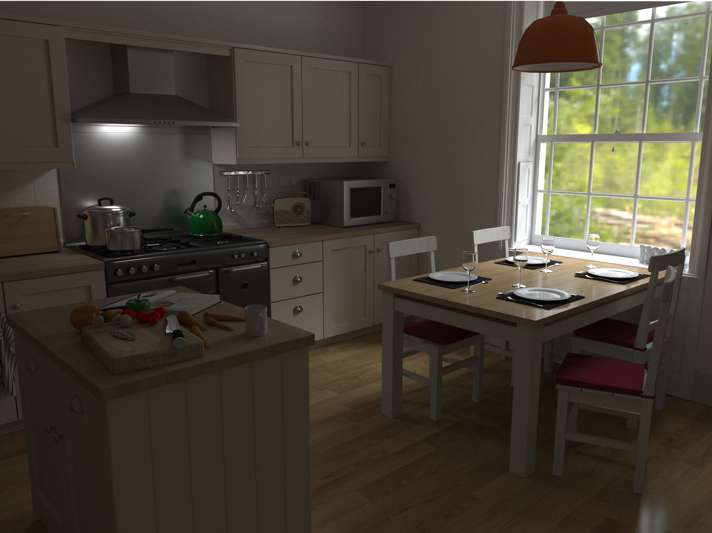

Fluctus
====================

OpenCL wavefront path tracer
--------------

## Features
- Physically based renderer
    - PBRT and OBJ scenefiles
    - Lambertian, glossy, ideal specular, and microfacet ([GGX][ggx]) BSDFs
    - Multiple importance sampled environment maps (alias method)
- [Wavefront path tracing][wavefront] at interactive framerates
    - Two implementations, one tuned for latency and the other for throughput
    - Optimized structure of arrays data layout
    - Efficient BVH with [spatial splits][sbvh]
- OptiX AI denoiser (on supported NVIDIA hardware)
    - Requires OptiX 7, CUDA 10.1+, driver 435.80+
- Supports a wide variety of systems
    - Cross-platform (Windows, MacOS, Linux)
    - NVIDIA, AMD and Intel GPUs and CPUs
    - CPU debugging with [Intel's OpenCL SDK][intel_ocl]
- Nanogui-based [user interface](gallery/user_interface.png)
    - Uses only modern OpenGL (3.3+)
- Uses [CLT][clt] for convenience and robustness
	

## Usage

Rename settings_default.json to settings.json. Modify to set default OpenCL device, render scale, window dimensions etc.

### Controls

| Key                     | Action                                                                                |
|-------------------------|---------------------------------------------------------------------------------------|
| **W / A / S / D**       | Move camera (up/down with R/F)                                                        |
| **Mouse left**          | Look around                                                                           |
| **Mouse right**         | Pick DoF focal depth (after setting aperture size)                                    |
| **Scroll Up / Down**    | Adjust movement speed                                                                 |
| **Space**               | Place area light                                                                      |
| **F1**                  | Reset camera                                                                          |
| **F2**                  | Save camera/area light state                                                          |
| **F3**                  | Load saved state                                                                      |
| **F5**                  | Export image                                                                          |
| **F6**                  | Toggle OptiX Denoiser (if built)                                                      |
| **H**                   | Toggle light sources (environment/area/both)                                          |
| **I / K**               | Adjust max bounces                                                                    |
| **Z / X**               | Adjust environment map emission                                                       |
| **L**                   | Open scene selector                                                                   |
| **M**                   | Switch sampling mode                                                                  |
| **U**                   | Toggle UI                                                                             |
| **Page Up / Down**      | Adjust area light emission                                                            |
| **1-5**                 | Select scene 1-5 (if set in settings.json)                                            |
| **7**                   | Switch metween microkernel/wavefront                                                  |
| **8 / 9**               | Change area light size                                                                |
| **, / .**               | Change FOV                                                                            |

## Build

See the [build instructions](./BUILDING.md).

## License

Source code and resources provided under the [MIT LICENSE](./LICENSE.md), unless otherwise specified.

[intel_ocl]: https://software.intel.com/intel-opencl
[wavefront]: http://research.nvidia.com/publication/megakernels-considered-harmful-wavefront-path-tracing-gpus
[sbvh]: https://www.nvidia.com/docs/IO/77714/sbvh.pdf
[ggx]: https://doi.org/10.2312/EGWR/EGSR07/195-206
[clt]: https://github.com/harskish/CLT
