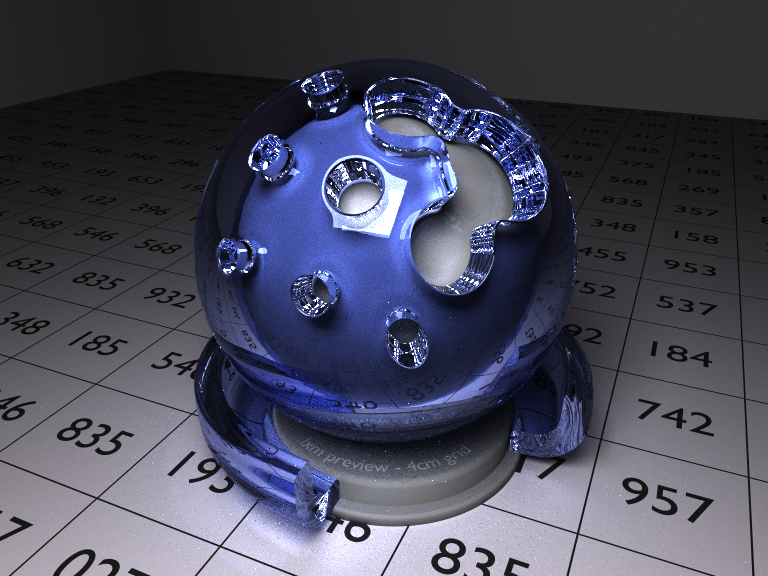

Fluctus
====================

OpenCL wavefront path tracer
--------------

## Features
- Physically based renderer
    -  OBJ + MTL scenefiles
    -  Lambertian and refractive BSDFs
    -  Caustics through MIS
- [Wavefront path tracing][wavefront] at interactive framerates
    - Optimized structure of arrays data layout
    - Efficient BVH with [spatial splits][sbvh]
- Supports a wide variety of systems
    - Cross-platform (Windows, MacOS, Linux)
    - NVIDIA, AMD and Intel GPUs and CPUs
    - CPU debugging with [Intel's OpenCL SDK][intel_ocl]

## Usage

Create settings.json to set default OpenCL device, render scale, default window dimensions etc.

### Controls

| Key                     | Action                                                                                |
|-------------------------|---------------------------------------------------------------------------------------|
| **W / A / S / D**       | Move camera (up/down with R/F)                                                        |
| **Mouse left**          | Look around                                                                           |
| **Scroll Up / Down**    | Adjust movement speed                                                                 |
| **Space**               | Place area light                                                                      |
| **F1**                  | Reset camera                                                                          |
| **F2**                  | Save camera/area light state                                                          |
| **F3**                  | Load saved state                                                                      |
| **I / K**               | Adjust max bounces                                                                    |
| **L**                   | Open scene selector                                                                   |
| **M**                   | Switch sampling mode                                                                  |
| **Page Up / Down**      | Adjust area light emission                                                            |
| **1-5**                 | Select scene 1-5 (if set in settings.json)                                            |
| **7**                   | Switch metween micro-/megakernel                                                      |
| **8 / 9**               | Change area light size                                                                |
| **, / .**               | Change FOV                                                                            |

## Build

See the [build instructions](./BUILDING.md).

## License

    Fluctus
    Copyright © 2017 Erik Härkönen
    
    Permission is hereby granted, free of charge, to any person obtaining a copy
    of this software and associated documentation files (the "Software"), to deal
    in the Software without restriction, including without limitation the rights
    to use, copy, modify, merge, publish, distribute, sublicense, and/or sell
    copies of the Software, and to permit persons to whom the Software is
    furnished to do so, subject to the following conditions:
    
    The above copyright notice and this permission notice shall be included in
    all copies or substantial portions of the Software.
    
    THE SOFTWARE IS PROVIDED "AS IS", WITHOUT WARRANTY OF ANY KIND, EXPRESS OR
    IMPLIED, INCLUDING BUT NOT LIMITED TO THE WARRANTIES OF MERCHANTABILITY,
    FITNESS FOR A PARTICULAR PURPOSE AND NONINFRINGEMENT. IN NO EVENT SHALL THE
    AUTHORS OR COPYRIGHT HOLDERS BE LIABLE FOR ANY CLAIM, DAMAGES OR OTHER
    LIABILITY, WHETHER IN AN ACTION OF CONTRACT, TORT OR OTHERWISE, ARISING FROM,
    OUT OF OR IN CONNECTION WITH THE SOFTWARE OR THE USE OR OTHER DEALINGS IN
    THE SOFTWARE.

[intel_ocl]: https://software.intel.com/intel-opencl
[wavefront]: http://research.nvidia.com/publication/megakernels-considered-harmful-wavefront-path-tracing-gpus
[sbvh]: http://www.nvidia.com/object/nvidia_research_pub_012.html
